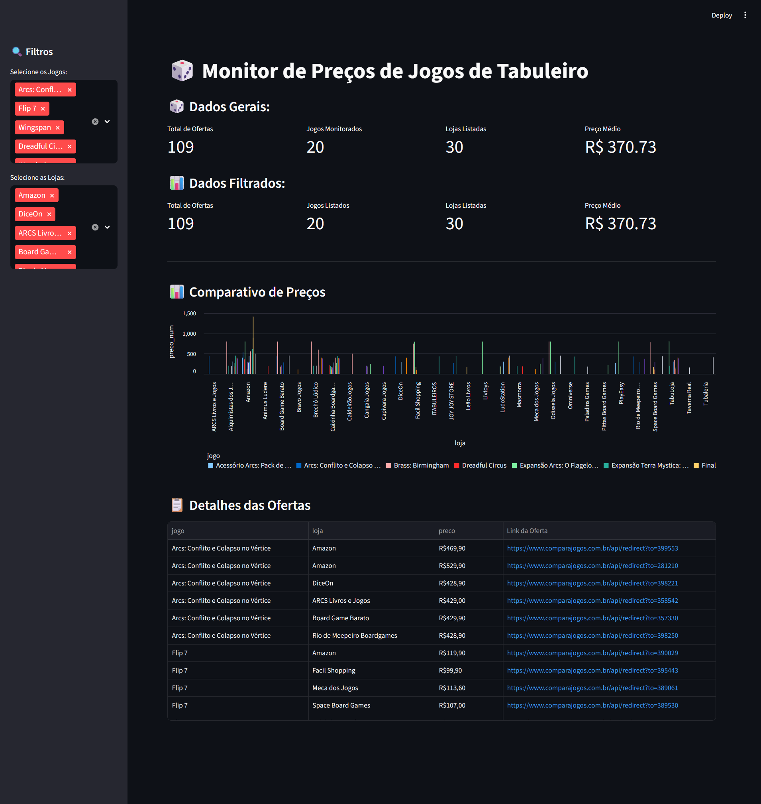
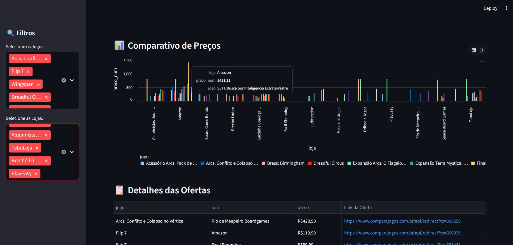
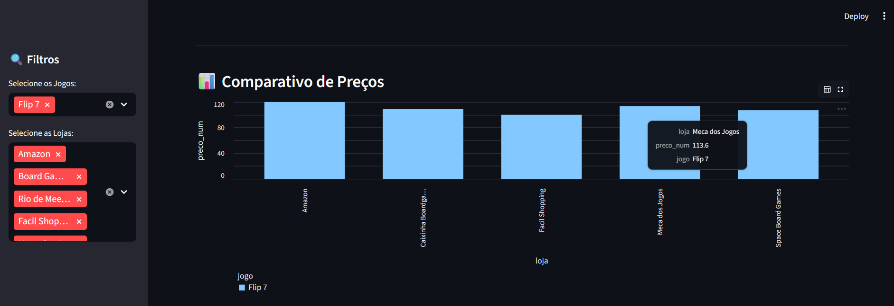

# 🎲 Monitor de Preços de Jogos de Tabuleiro

> Um projeto de automação Full Stack (ETL + Dashboard) para monitoramento e comparação de preços de board games populares.


## 📖 Sobre o Projeto

Este projeto foi desenvolvido para automatizar a coleta de preços do site *Compara Jogos*. O objetivo é identificar as melhores ofertas dos jogos mais populares da semana, estruturar esses dados e apresentá-los em um dashboard interativo para tomada de decisão.

O sistema opera em três etapas principais:
1.  **Extração (Scraping):** Um robô navega no site, identifica a seção de populares e coleta dados de múltiplas lojas.
2.  **Transformação:** Limpeza de dados, conversão de moeda e tratamento de erros.
3.  **Visualização:** Um dashboard web com filtros dinâmicos e gráficos comparativos.

---

## 📸 Demonstração

### Vídeo Demonstrativo
**[Clique Aqui para Acessar o Vídeo Demonstrativo](https://drive.google.com/file/d/1OXa97NbMjoEnImsWswYo3AmcCVF55zf2/view?usp=sharing)**
Obs.: Funcionamento prático começa em 08:30min


### Visão Geral do Dashboard


### Comparativo de Preços por Loja

---


---

## 🚀 Funcionalidades

- **🕷️ Web Scraping Robusto:**
    - Uso do `Playwright` para lidar com carregamento dinâmico.
    - Navegação automática e extração de detalhes (Nome, Loja, Preço, Link).
    - Persistência dos dados em CSV (`games_data.csv`).

- **📊 Dashboard Interativo:**
    - **Filtros Dinâmicos:** Selecione jogos e lojas específicas para comparar.
    - **KPIs:** Total de ofertas, jogos monitorados, lojas listadas e preço médio.
    - **Gráficos:** Visualização clara de qual loja oferece o menor preço.
    - **Links Diretos:** Tabela com links clicáveis que levam direto à oferta.

---

## 🛠️ Tecnologias Utilizadas

- **[Python](https://www.python.org/)**: Linguagem base.
- **[Playwright](https://playwright.dev/)**: Automação de navegador e extração de dados.
- **[Pandas](https://pandas.pydata.org/)**: Manipulação e análise de dados (Dataframes).
- **[Streamlit](https://streamlit.io/)**: Criação do frontend e dashboard de dados.

---

## 📂 Estrutura do Projeto

```bash
desafio-automacao/
├── assets/              # Prints e imagens para o Readme
├── venv/                # Ambiente virtual (não versionado)
├── app.py               # Código do Dashboard (Streamlit)
├── scraper.py           # Código do Robô (Playwright)
├── games_data.csv       # Base de dados gerada (Output)
├── requirements.txt     # Dependências do projeto
└── README.md            # Documentação
```

## ⚡ Como Executar

Siga os passos abaixo para configurar o ambiente e rodar o projeto na sua máquina.

### 1. Pré-requisitos

Certifique-se de ter instalado:
* **[Python 3.8+](https://www.python.org/downloads/)**: A linguagem base do projeto.
* **Git**: Para clonar o repositório.

### 2. Instalação e Configuração

Abra o terminal na pasta onde deseja salvar o projeto e execute os comandos abaixo:

```bash
# 1. Clone o repositório
git clone [https://github.com/matheus-rodrigues-m/desafio-automacao.git](https://github.com/matheus-rodrigues-m/desafio-automacao.git)
cd desafio-automacao
```
```bash
# 2. Crie um ambiente virtual (Recomendado)
# No Windows:
python -m venv venv
.\venv\Scripts\activate
# No Linux/Mac:
# python3 -m venv venv
# source venv/bin/activate
# Dependendo do terminal:
# source venv/Scripts/activate
```
```bash
# 3. Instale as dependências do projeto
pip install -r requirements.txt
```
```bash
# 4. Instale os navegadores necessários para o Playwright
playwright install
```


### 3. Executando o Robô (Coleta de Dados)

Execute o robô para varrer o site e gerar o arquivo CSV atualizado:

```bash
python scraper.py
```
O terminal exibirá o progresso da coleta. Ao final, o arquivo games_data.csv será criado/atualizado com as informações mais recentes.


### 4. Executando o Robô (Coleta de Dados)

Com os dados coletados, inicie a aplicação visual para explorar os gráficos e tabelas:

```bash
streamlit run app.py